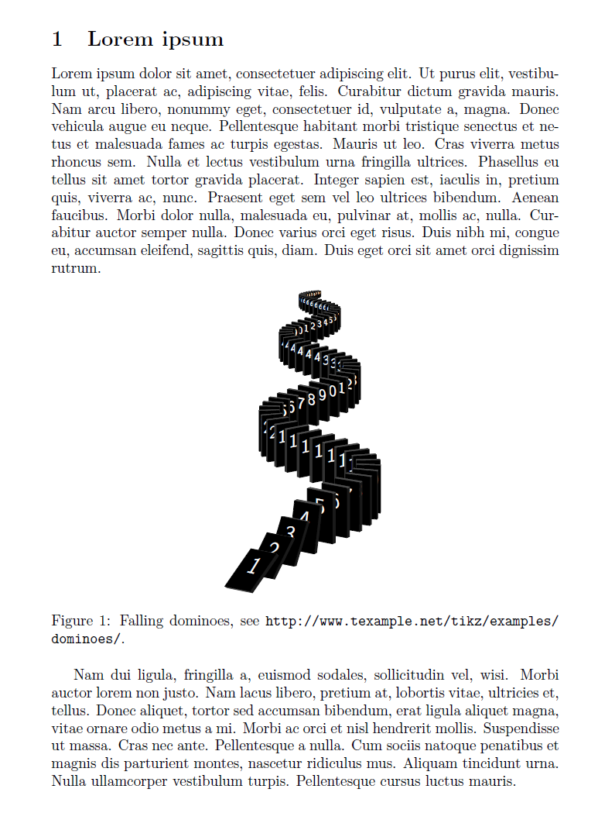
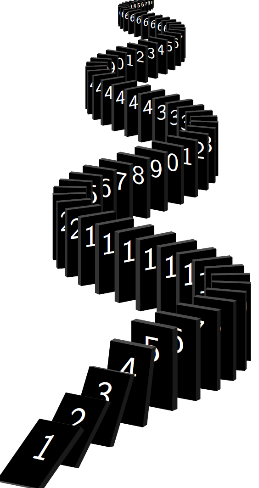

# TikzExternalize - example usage of tikzexternalize

## Note

You have to make sure that you include `--shell-escape` parameter when invoking pdflatex. For TeXstudio goto `Options > Configure TeXStudio > Commands` and substitute the following

~~pdflatex -synctex=1 -interaction=nonstopmode %.tex~~
  
pdflatex -synctex=1 -interaction=nonstopmode --shell-escape %.tex

## Example

The [compiled example](tikzExternalize.pdf) looks like this 

  

In the `figures` directory you have the [standalone image](figure/tikzExternalize-figure0.pdf)

  

The image is taken from [here](http://www.texample.net/tikz/examples/dominoes/).
